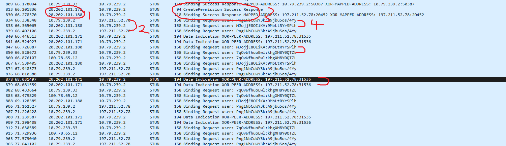
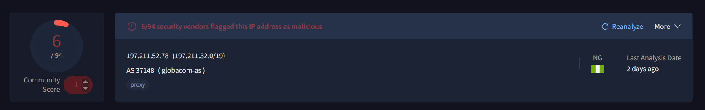

# Network-Security-Investigation
 
 The rabbt hole  went down runnng wreshar 

 # STUN Traffic Investigation

You're probably wondering what led to this investigation — 
honestly it started as a "what if" question in my head, 
a "just do it" kind of feel. So I did, and the result 
was educational.

## Tools Used
- Wireshark
- VirusTotal
- TCPView (Sysinternals)
- Windows Defender Firewall

## Initial Capture

The above image shows filtered captured traffic. 
What stood out the most were the following red flags:

## Red Flags

1. Suspicious source IP: 20.202.101.171
2. Suspicious destination IP: 197.211.52.78
3. Plaintext credentials visible in packet: `Binding Request user: user:passwd` syntax
4. Repeated intervals of flag 3 — persistent attempts
5. Binding Success Response confirmed

## Tran of thought 
 After seeng all ths my SOC-sense were tnglng to too that Dest p and pasted t n vrus total and NOT to my - 
 surprse the destnaton p had a 6/94 score on vrus total whle the source had a score of zero as seen below and 
 that my SOC lv1 frend s enough reason for me to escalate ths tcet to a snr SOC Analyst.   
 
 
 

 
 
 ## Mtgaton Process
 Seeng as ths s my personal system on a networ  consdred publc  too to my wndows defnender fre wall and bloced all ths assocated p addr usng ths not lazy step placed below
