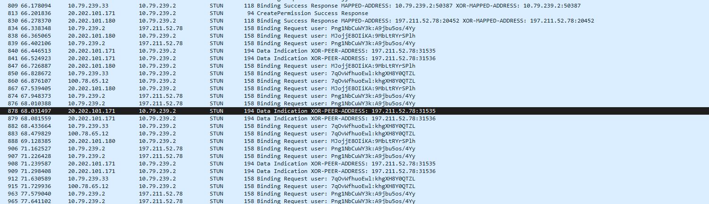
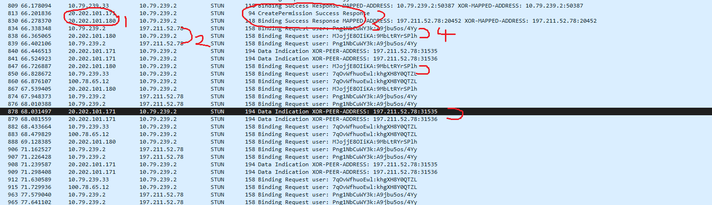
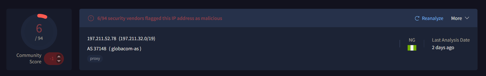
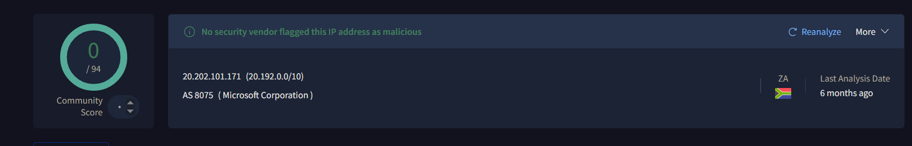

# Network-Security-Investigation
 
 The rabbit hole i went down running wireshark 

 # STUN Traffic Investigation

You're probably wondering what led to this investigation 
honestly it started as a "what if" question in my head, 
a "just do it" kind of feel. So I did, and the result 
was educational.

## Tools Used
- Wireshark
- VirusTotal
- TCPView (Sysinternals)
- Windows Defender Firewall

## Initial Capture

The above image shows filtered captured traffic. 
What stood out the most were the following red flags:

## Red Flags

1. Suspicious source IP: 20.202.101.171
2. Suspicious destination IP: 197.211.52.78
3. Plaintext credentials visible in packet: `Binding Request user: user:passwd` syntax
4. Repeated intervals of flag 3 — persistent attempts
5. Binding Success Response confirmed

## Tran of thought 
 After seeng all ths my SOC-sense were tinglng to too that Dest Ip and pasted it in virus total and NOT to my  
 surprise the destination ip had a 6/94 score on virus total while the source had a score of zero as seen below and 
 that my lv1 SOC friend is enough reason for me to escalate this ticket to a snr SOC Analyst.   
 
 
 

 
 
 ## Mitigation Process

Seeing as this is my personal system on a network considered 
public, I took to my Windows Defender Firewall and blocked 
all associated IP addresses using the following steps:

### Steps Taken

1. Open **Windows Defender Firewall with Advanced Security**
2. Navigate to **Outbound Rules** → **New Rule**
3. Select **Custom** → Next
4. Program → **All Programs** → Next
5. Protocol → **Any** → Next
6. Remote IP Addresses → **Add the following:**
   - 20.202.101.171
   - 20.202.101.180
   - 197.211.52.78
   - 100.78.65.12
7. Action → **Block the connection**
8. Profile → tick **Domain, Private, Public**
9. Name → `Sus-TURN-Investigation-Block`

### Verification

To verify the block is working, monitor:

Event Viewer → 
Windows Logs → 
Security → 
Filter by Event ID 5157

Event ID 5157 confirms Windows successfully 
filtered a blocked connection attempt.

## Conclusion

What started as a curious "what if" turned into a 
legitimate security investigation. Key takeaways:

- STUN/TURN traffic can mask malicious peer connections
- XOR Peer Address decodes to the real destination IP
- Plaintext STUN credentials = unencrypted channel = red flag
- Always correlate suspicious IPs with threat intel (VirusTotal)
- TCPView limitations — TURN relay hides final destination
